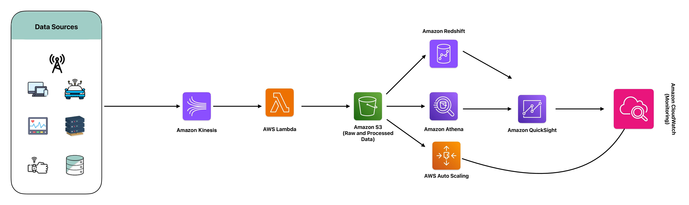
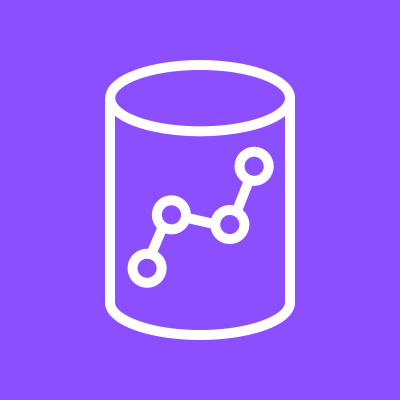
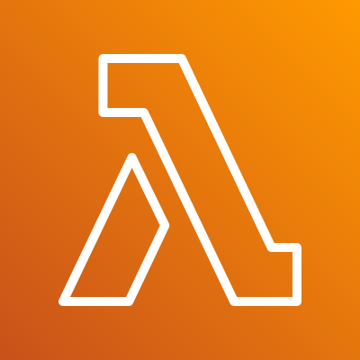

# Scalability and Performance Solution
As data volumes grow, organizations face challenges in scaling their data processing capabilities and optimizing query performance. Traditional data processing and query execution methods often struggle to handle large datasets efficiently, leading to slow query responses and performance bottlenecks.

## Sample Scenario - MadHatter Corp.
As data volumes grow, organizations face challenges in scaling their data processing capabilities and optimizing query performance. `MadHatter Corp.`, a global leader in online retail, has been grappling with the increasing volume of data generated by its diverse operations. The company collects vast amounts of data from user interactions, sales transactions, inventory management, and customer support, among other sources. Traditional data processing and query execution methods have struggled to handle these large datasets efficiently, leading to slow query responses and performance bottlenecks.

For `MadHatter Corp.`, these performance issues translate into significant business challenges. Slow query responses delay critical business insights, affecting decision-making and operational efficiency. Performance bottlenecks hinder the ability to quickly analyze sales trends, manage inventory levels, and provide personalized recommendations to customers. This results in lost revenue opportunities, suboptimal inventory management, and diminished customer satisfaction.

To tackle these challenges, `MadHatter Corp.` designed a solution using Amazon Redshift for data warehousing, Amazon Athena for serverless query execution, AWS Lambda for serverless compute, and Amazon Kinesis for real-time data streaming. Additionally, they leverage AWS Auto Scaling and Elastic Load Balancing to ensure scalability and performance.

By implementing this scalable data processing and query optimization architecture, `MadHatter Corp.` can effectively handle its growing data volumes and ensure fast query responses. The solution enables real-time data processing and analysis, providing immediate insights for better decision-making. With the ability to scale data processing capabilities and optimize query performance, `MadHatter Corp.` can enhance operational efficiency, improve inventory management, and deliver a personalized customer experience. This comprehensive approach ensures that `MadHatter Corp.` remains competitive in the dynamic online retail landscape, driving business growth and customer satisfaction.

## AWS Tools Used - DeepDive

### Amazon Redshift

`Amazon Redshift` is a fully managed data warehouse that allows you to analyze large datasets using standard SQL and business intelligence tools. It is designed for high-performance query execution and can scale from a few hundred gigabytes to a petabyte or more.

    

#### Key Features:

-Massively Parallel Processing (MPP): Distributes data and query load across multiple nodes, speeding up complex queries.
- Columnar Storage: Optimizes storage and retrieval for analytical queries.
- Compression: Reduces storage costs and improves performance by compressing data.
- Redshift Spectrum: Enables querying of data stored in Amazon S3 without having to load it into Redshift.

#### Use in Project:
`Amazon Redshift` is used as the primary data warehousing solution, storing large volumes of structured data from various sources. It provides fast query performance, allowing MadHatter Corp. to perform complex analytics and reporting efficiently.

### Amazon Athena

`Amazon Athena` is an interactive query service that makes it easy to analyze data directly in Amazon S3 using standard SQL. Athena is serverless, so there is no infrastructure to manage, and you pay only for the queries you run.

    

#### Key Features:

- Serverless Architecture: Eliminates the need to set up or manage servers.
- Standard SQL Support: Allows you to use familiar SQL syntax to query data.
- Integration with S3: Directly queries data stored in Amazon S3, supporting a wide range of formats including CSV, JSON, ORC, Avro, and Parquet.
- Cost-Effective: Charges based on the amount of data scanned by the queries.

#### Use in Project:
`Amazon Athena` is used for ad-hoc querying and analysis of data stored in Amazon S3. It allows MadHatter Corp. to quickly run queries on large datasets without needing to load the data into a database, providing flexibility and cost savings for exploratory analysis.

### AWS Lambda

`AWS Lambda` is a serverless compute service that runs your code in response to events and automatically manages the underlying compute resources. It allows you to build applications that respond quickly to new information.

    

#### Key Features:

- Event-Driven Execution: Runs code in response to triggers such as changes to data, HTTP requests, or system events.
- Automatic Scaling: Automatically scales based on the number of incoming events.
- Pay-As-You-Go: Charges only for the compute time you consume, making it cost-effective.
- Wide Language Support: Supports multiple programming languages including Python, Node.js, Java, C#, and Go.

#### Use in Project:
`AWS Lambda` is used to process data in real-time as it streams through Amazon Kinesis. It performs tasks such as data transformation, enrichment, and forwarding to other services like Amazon Redshift and Amazon Elasticsearch Service, ensuring immediate processing and action on incoming data.

### Amazon Kinesis

`Amazon Kinesis` is a platform for real-time data streaming on AWS, making it easy to collect, process, and analyze real-time, streaming data. It is ideal for applications that require continuous, real-time data processing.

    

#### Key Features:

- Real-Time Data Capture: Captures streaming data from various sources and processes it in real-time.
- Scalability: Scales to handle gigabytes of data per second from hundreds of thousands of sources.
- Multiple Services: Includes Kinesis Data Streams, Kinesis Data Firehose, Kinesis Data Analytics, and Kinesis Video Streams for different use cases.
- Integration with AWS Services: Integrates seamlessly with AWS services such as AWS Lambda, Amazon S3, Amazon Redshift, and more.

#### Use in Project:
`Amazon Kinesis` is used to capture and stream real-time data from various sources within MadHatter Corp. This includes user interactions, transaction logs, and IoT devices. Kinesis ensures that data is ingested as it arrives, enabling immediate processing and analysis.

### AWS Auto Scaling

`AWS Auto Scaling` monitors your applications and automatically adjusts capacity to maintain steady, predictable performance at the lowest possible cost. It allows you to scale multiple resources across multiple services quickly and easily.

    

#### Key Features:

- Dynamic Scaling: Automatically adjusts the number of EC2 instances based on demand.
- Predictive Scaling: Uses machine learning to predict future traffic and scale in advance.
- Target Tracking: Maintains target utilization levels for each resource.
- Integrated with AWS Services: Works with EC2, ECS, DynamoDB, Aurora, and more.

#### Use in Project:
`AWS Auto Scaling` is used to ensure that MadHatter Corp.'s infrastructure scales automatically in response to changes in demand. This includes scaling EC2 instances for compute needs, ensuring that the application can handle peak loads without performance degradation.

## References
- [Amazon Redshift Documentation](https://docs.aws.amazon.com/redshift/)
- [Amazon Athena Documentation](https://docs.aws.amazon.com/athena/)
- [AWS Lambda Documentation](https://docs.aws.amazon.com/lambda/)
- [Amazon Kinesis Documentation](https://docs.aws.amazon.com/kinesis/)
- [AWS Auto Scaling Documentation](https://docs.aws.amazon.com/autoscaling/)

