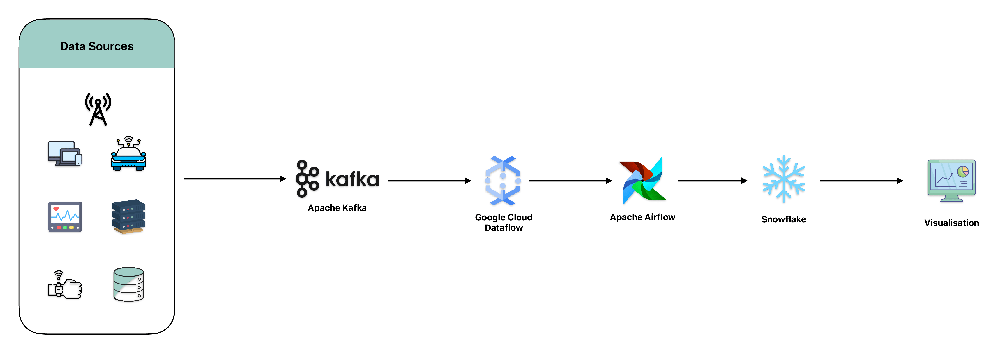

### Scalable Data Processing and Query Optimization Using GCP, Kafka, Snowflake, and Airflow

#### Project Overview
As data volumes grow, organizations face challenges in scaling their data processing capabilities and optimizing query performance. MadHatter Corp., a global leader in online retail, was struggling to efficiently process the increasing amount of data generated by its diverse operations, including user interactions, sales transactions, inventory management, and customer support. Traditional data processing and query execution methods could no longer handle these large datasets, leading to slow query responses and performance bottlenecks.

These performance issues presented significant business challenges for MadHatter Corp. Slow query responses delayed the company's ability to extract critical business insights, impacting decision-making and operational efficiency. Bottlenecks in processing slowed down key tasks such as sales trend analysis, inventory management, and delivering personalized customer recommendations. This resulted in lost revenue opportunities, suboptimal inventory management, and decreased customer satisfaction.

#### Solution Overview

To address these challenges, MadHatter Corp. implemented a scalable data processing and query optimization solution utilizing **Google Cloud Platform (GCP)**, **Apache Kafka**, **Snowflake**, and **Apache Airflow**. This modern architecture was designed to handle large-scale data processing, ensure rapid query performance, and provide real-time analytics, ensuring that MadHatter Corp. could continue delivering top-tier service in the fast-moving world of e-commerce.

#### Key Components

##### **1. Apache Kafka**
**Apache Kafka** was implemented as the backbone for real-time data streaming and ingestion. Kafka captures and processes vast amounts of data from various sources, such as user interactions, transaction logs, and IoT devices, in real-time. This provided the company with the infrastructure to ingest, process, and manage high-velocity data streams, enabling real-time data pipelines.

**Key Features:**
- **Real-Time Data Streaming:** Captures and streams data from multiple sources in real time.
- **Scalability:** Efficiently handles growing data volumes with minimal performance degradation.
- **Fault Tolerance:** Ensures high availability, even in the event of hardware failures.

**Use in Project:**
Kafka is responsible for streaming real-time data from sources such as website interactions, sales events, and mobile app activities. By processing data as it arrives, MadHatter Corp. can respond quickly to changes, such as adjusting inventory or providing personalized offers to users in real-time.

##### **2. Google Cloud Dataflow**
**Google Cloud Dataflow** was used for scalable data processing and transformation. Its serverless nature and integration with Apache Kafka allowed MadHatter Corp. to handle growing data volumes with ease. Dataflow also enabled complex transformations and data enrichments in real-time, ensuring that processed data was ready for analysis in near real-time.

**Key Features:**
- **Serverless Architecture:** Automatically scales to handle large volumes of data without the need for infrastructure management.
- **Integration with Apache Kafka:** Provides seamless integration for real-time data ingestion and processing.
- **Stream and Batch Processing:** Supports both real-time (streaming) and scheduled (batch) data processing needs.

**Use in Project:**
Dataflow was responsible for transforming and enriching the data as it was ingested from Kafka streams. This included tasks such as filtering, aggregating, and formatting data before loading it into Snowflake, ensuring that all data was ready for immediate analysis.

##### **3. Snowflake**
**Snowflake** was used as the primary data warehousing solution. Snowflake's cloud-native architecture, combined with its automatic scaling and optimized query performance, made it ideal for managing the large volumes of data generated by MadHatter Corp. It allowed for fast queries and analytics on massive datasets, ensuring the business could gain timely insights and make data-driven decisions quickly.

**Key Features:**
- **Multi-Cluster Architecture:** Automatically scales compute resources to meet varying workloads without manual intervention.
- **Separation of Storage and Compute:** Allows for independent scaling of data storage and processing power.
- **Optimized Query Performance:** Uses adaptive query processing techniques to deliver fast analytics even on complex queries.

**Use in Project:**
Snowflake served as the centralized data warehouse, storing both real-time and batch-processed data from Kafka and Dataflow. Its high-performance querying capabilities allowed analysts to quickly extract insights, enabling fast decision-making across the organization, such as optimizing inventory and tailoring marketing efforts to customer behavior.

##### **4. Apache Airflow**
**Apache Airflow** was implemented to orchestrate and automate the various data workflows across the architecture. It provided MadHatter Corp. with the ability to schedule, monitor, and manage data pipelines, ensuring smooth and reliable operation of ETL processes, data transformations, and integrations between different services.

**Key Features:**
- **Task Scheduling and Orchestration:** Automates and manages complex workflows with clear dependencies between tasks.
- **Monitoring and Alerts:** Tracks the status of workflows and sends alerts in case of failure or other issues.
- **Modular and Scalable:** Easily integrates new workflows and scales with increasing data complexity.

**Use in Project:**
Airflow managed the scheduling of daily and hourly jobs, including triggering ETL processes, data pipeline execution, and syncing data between Snowflake and reporting tools. It ensured that data workflows ran seamlessly, minimizing operational overhead and ensuring data was always up-to-date.

#### **Supporting GCP Tools**

##### **Google Cloud Pub/Sub**
Google Cloud Pub/Sub was used for real-time event streaming to integrate various services within the architecture. This allowed MadHatter Corp. to trigger real-time alerts and actions based on event streams such as customer actions or inventory levels.

##### **Google Cloud Functions**
Google Cloud Functions was utilized for lightweight serverless processing of event-driven tasks. Functions were triggered by Pub/Sub events and performed specific tasks such as data validation, monitoring, or fraud detection, ensuring rapid response times.

##### **Looker Studio (formerly Google Data Studio)**
**Looker Studio** was implemented for real-time data visualization and reporting. Its integration with Snowflake allowed decision-makers to view dynamic dashboards with up-to-the-minute insights into user behavior, sales trends, and system performance.

#### **Outcome**
By implementing this scalable data processing and query optimization architecture, MadHatter Corp. was able to manage its growing data volumes and drastically improve query performance. Key outcomes included:

- **Real-time Data Processing:** Kafka and Dataflow ensured real-time data ingestion and processing, allowing for immediate action on streaming data.
- **Optimized Query Performance:** Snowflake provided high-performance querying, enabling quick decision-making and operational efficiency.
- **Automation and Orchestration:** Airflow ensured the automation and reliability of data workflows, reducing manual intervention and improving data availability.
- **Enhanced Business Insights:** The integrated solution provided real-time insights for better inventory management, personalized customer experiences, and operational monitoring.
- **Competitive Advantage:** This scalable architecture empowered MadHatter Corp. to stay competitive by quickly responding to market trends, driving customer satisfaction, and ensuring business growth.

#### References
- [Google Cloud Dataflow Documentation](https://cloud.google.com/dataflow/docs)
- [Apache Kafka Documentation](https://kafka.apache.org/documentation/)
- [Snowflake Documentation](https://docs.snowflake.com/)
- [Apache Airflow Documentation](https://airflow.apache.org/docs/)